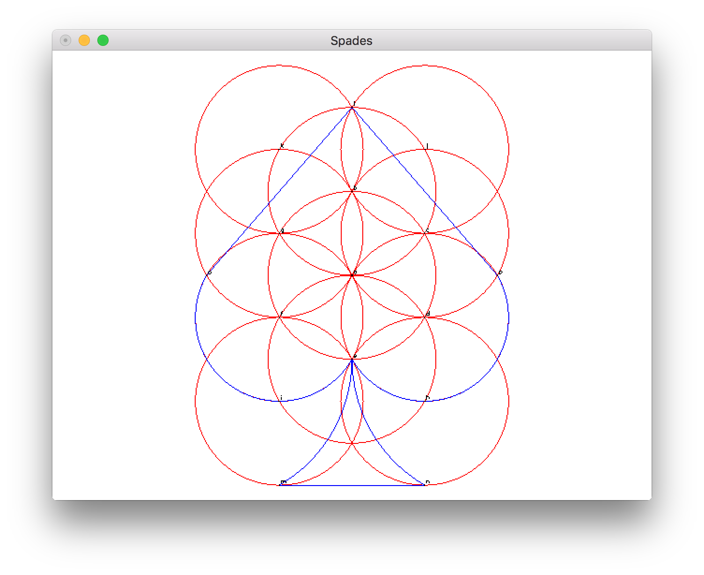
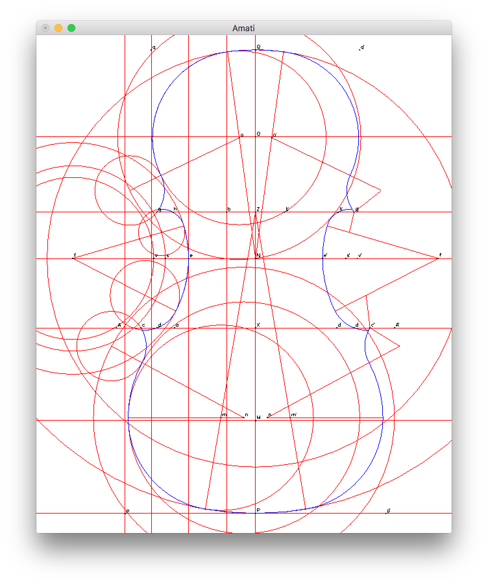

# euclideanhaskell
Functional programming interface for euclidean constructions or: How to make cool drawings pretending to have only a ruler and compass.



This is a project I worked on while learning functional programming using Haskell. It was inspired by Harry Mairson's paper "Functional Geometry and the Traité de Lutherie" (check the references below). Essentially here I'm using functional programming to recreate compass and straightedge constructions. Haskell provides us with a very powerful way to abstract many details of the drawing process, allowing us to create simple and clear description of what we are interested in building.



## Compiling the code

You will need

- [Haskell Platform](https://www.haskell.org/platform/) - One of the Haskell distributions you can use.
- [Graphics.Gloss](http://gloss.ouroborus.net/) - Graphics library.

You can simply compile the code using the usual GHC command, for instance:

```shell
$ ghc -o Spades Spades.hs 
```

## Files

- `Help.hs`: Here is where all the functions used to draw are. 
- `Amati.hs`: Draws the Amati violin.
- `Hexagon.hs`: Draws a hexagon.
- `Lute.hs`: Draws a lute.
- `Pentagon.hs` and `Pentagon2.hs`: Two different ways of drawing a pentagon.
- `Spades.hs`: Draws the spades card suit.

## References

Harry George Mairson. 2013. Functional geometry and the Traité de Lutherie: functional pearl. In Proceedings of the 18th ACM SIGPLAN international conference on Functional programming (ICFP '13). ACM, New York, NY, USA, 123-132.
